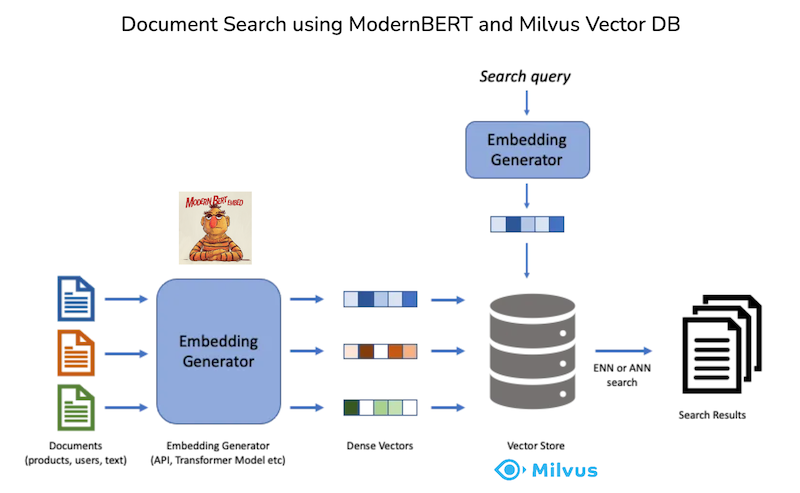

# Semantic Document Search with ModernBERT and Milvus

This repository contains a full-stack application for semantic document search using **ModernBERT** for embedding generation and **Milvus** as the vector database. The backend is built with **FastAPI**, and the frontend is implemented using **Vite**.

## Basic System Architecture



## Features

- Generate semantic embeddings for documents using ModernBERT.
- Store and index embeddings in Milvus for fast and scalable search.
- Perform semantic queries to retrieve contextually relevant documents.
- User-friendly interface for submitting queries and visualizing results.

---

## Project Structure

```

📂 backend/ # FastAPI backend for search
📂 frontend/ # Vite-based frontend for user interaction
```

---

## Document Embedding and Insertion

The process of reading documents, generating embeddings using ModernBERT, and inserting them into the Milvus vector database is handled separately using a Jupyter notebook. This notebook provides a streamlined approach for preprocessing and indexing documents before they can be queried in the application. You can find and run the notebook [here](path/to/your/notebook.ipynb). Make sure to configure the necessary environment variables and Milvus connection details in the notebook.

---

## Prerequisites

Ensure you have the following installed on your system:

- **Python 3.10+**
- **Node.js 16+** (for the frontend)
- **Docker** (for running Milvus)

---

## Getting Started

### Step 1: Clone the Repository

```bash
git clone https://github.com/yourusername/semantic-document-search.git
cd semantic-document-search
```

### Step 2: Start Milvus

Start a Milvus instance using Docker:

```bash
curl -sfL https://raw.githubusercontent.com/milvus-io/milvus/master/scripts/standalone_embed.sh -o standalone_embed.sh

bash standalone_embed.sh start

```

> **Note:** Ensure Docker is running on your system.

After running the installation script, a docker container named milvus has been started at port 19530. For more information about how to install and run Milvus, please see [here](https://milvus.io/docs/install_standalone-docker.md).

---

## Backend Setup

1. Navigate to the `backend` directory:

   ```bash
   cd backend
   ```

2. Create a Python virtual environment and activate it:

   ```bash
   python -m venv venv
   source venv/bin/activate
   ```

3. Install dependencies:

   ```bash
   pip install -r requirements.txt
   ```

4. Start the FastAPI server:
   ```bash
   uvicorn main:app --host 0.0.0.0 --port 8050 --reload
   ```
   The backend will be running at [http://localhost:8050](http://localhost:8050).

---

## Frontend Setup

1. Navigate to the `frontend` directory:

   ```bash
   cd frontend
   ```

2. Install dependencies:

   ```bash
   npm install
   ```

3. Start the Vite development server:
   ```bash
   npm run dev
   ```
   The frontend will be running at the URL displayed in the terminal (e.g., [http://localhost:5173](http://localhost:5173)).

---

## License

This project is licensed under the MIT License.

## Acknowledgments

- **ModernBERT** for semantic embeddings: [Hugging Face ModernBERT Blog](https://huggingface.co/blog/modernbert)
- **Milvus** for vector database: [Milvus Documentation](https://milvus.io/docs)
